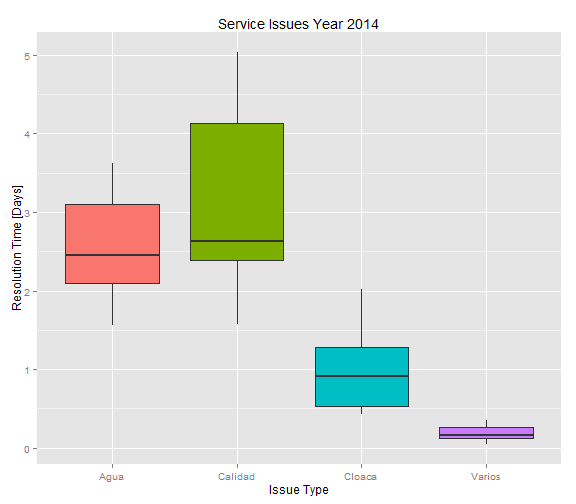

Developing Data Products Project
========================================================
author: Roberto Gonzalo Rodriguez
date: 09/26/2015

This presentation is the Part 2 project requiered by the Coursera Developing Data Products Course. It depicts the Shiny application that can be accessed from this [link](https://gonzarodri.shinyapps.io/CourseraDataProductShinyProject), which is the Part 1 of the project.

About the application
========================================================

The shiny application is part of a **Dashboard** for a company that serves dinking water and process sewage. The software was developed having in mind the following:

- It will be used by managers and people that do not have programming skills.
- The information has to be represented in different levels of detail
- The dashboard has to be able to predict how many days an issue resolution will take.
- It has to be well organized using tabs.

Data
========================================================
The sample data was taken form the issue tracker system of the company and anonimized for the purposes of this work, and has the following structure:
<small>
<code>

```
'data.frame':	34968 obs. of  7 variables:
 $ Id            : int  328409 328416 328479 328424 328434 328438 328441 328432 328461 328452 ...
 $ Type          : Factor w/ 4 levels "Agua","Calidad",..: 3 1 3 1 3 1 3 1 1 1 ...
 $ Zone          : Factor w/ 6 levels "Capital","Chimbas",..: 4 6 5 6 1 1 6 4 2 2 ...
 $ Start         : POSIXct, format: "2014-01-01 09:17:55" "2014-01-01 19:41:15" ...
 $ End           : POSIXct, format: "2014-01-04 16:44:36" "2014-01-02 19:35:48" ...
 $ Month         : int  1 1 1 1 1 1 1 1 1 1 ...
 $ ResolutionDays: num  3.31 1 1.42 1.5 0.44 0.4 0.44 5.39 1.39 1.41 ...
```
</code>
</small>
Plot
========================================================
The default tab allows the user to create a boxplot chart by selecting the X and Y axis. Also, the data frame can be filtered by type and/or zone. Because for some comparissons there are boxplots near zero, it can be selected a logarithmic scale for de Y axis. As an example, the user will see a plot like this one:  
 

Prediction and Data Table
========================================================
**Prediction**
The tab *Prediction* allows the user to estimate the resolution time (in days) for an issue of a determined type and located in an specified zone. A linear regression model is used for this task. The model is created inside the application in the global section and is available during the session.

**Data Table**
In this place, the user can browse, filter and order the issues data frame used for the application. The filters are responsive and applied by the server as soon as the input fields change.

**Help**
The application includes a *Help* tab containing the documentation about what is the objetives of the dashboard as well as the way it can be used.
